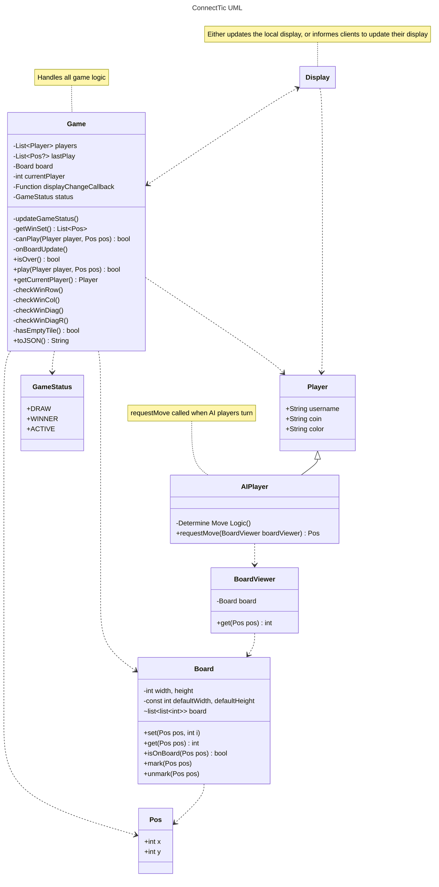

# connecttic

A mix between the classic Connect 4 and Tic-Tac-Toe

## Attribution

- **Game Design**
  - KittKat
  - *Artist*
- **Programming**
  - KittKat
- **Music**
  - *Artist*

## Dev




```
Display
Game Manager (handles working with local or remote game)
Game
```

